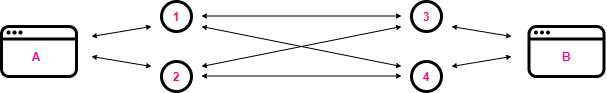

# tool-db-cli

*DISCLAIMER: WORK IN PROGRESS/NOT PRODUCTION-READY*

`tool-db` runs a [tool-db](https://github.com/Manwe-777/tool-db) server from your command line

## Installation

`npm i -g tool-db-cli`

### Example: Watching an expression

Start local tool-db server:

`tool-db serve watch=foobar`

Connect and put data from another local server:

`tool-db put --peers=0.0.0.0:8000 foobar myvalue`

### Example: Using repl

Start local tool-db server with `--repl`

`tool-db serve --repl`

Output

```

ToolDB node running at http://127.0.0.1:8080

Storage:  tooldb
>
```

You can access access `tooldb` instance directly from repl

```
> await tooldb.anonSignIn();
> await tooldb.putData("key", "value")
```

### Example: Creating a redundant mesh network



**start a small mesh network of tool-db servers**, each listening on a different IP and saving data in a different folder.

```sh
tool-db --host=8081 --peers=127.0.0.1:8083,127.0.0.1:8084  --storageName=data1 # 1
tool-db --host=8082 --peers=127.0.0.1:8083,127.0.0.1:8084  --storageName=data2 # 2

tool-db --host=8083 --peers=127.0.0.1:8081,127.0.0.1:8082  --storageName=data3 # 3
tool-db --host=8084 --peers=127.0.0.1:8081,127.0.0.1:8082  --storageName=data4 # 4
```

**now play around with shutting down individual peers and bringing them back online**

As long as there is a path through the mesh network, the heartbeats will propagate from B to A. 

But if peers 1 and 2 (or peers 3 and 4) simultainiously go down, A and B are seperated 
and updates won't go through. However, ToolDB peers will try to reestablish the connection 
to a lost peer, so as soon as you bring one of the peers back online, they will reconnect 
and updates will go through again. 

## Usage

```
tool-db serve

start tool-db server on http

Options:
  --version      Show version number                                   [boolean]
  --help         Show help                                             [boolean]
  --db           database name to use                                   [string]
  --storageName  our storage namespace              [string] [default: "tooldb"]
  --peers        comma-seperated list of URLs and IPs                   [string]
  --watch        comma-separated list of keys to watch                  [string]
  --host         set ip to listen on             [string] [default: "127.0.0.1"]
  --port         set port to listen on                  [number] [default: 8080]
  --debug        enable debug mode                    [boolean] [default: false]
```
